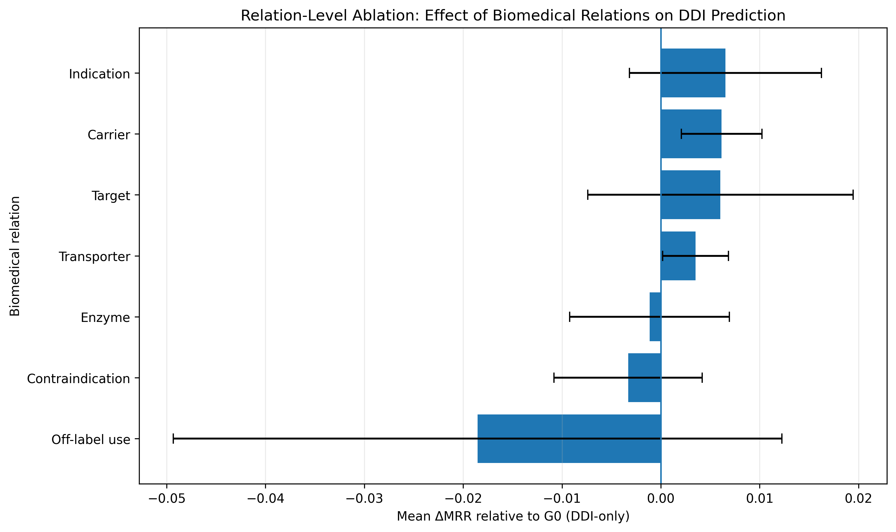
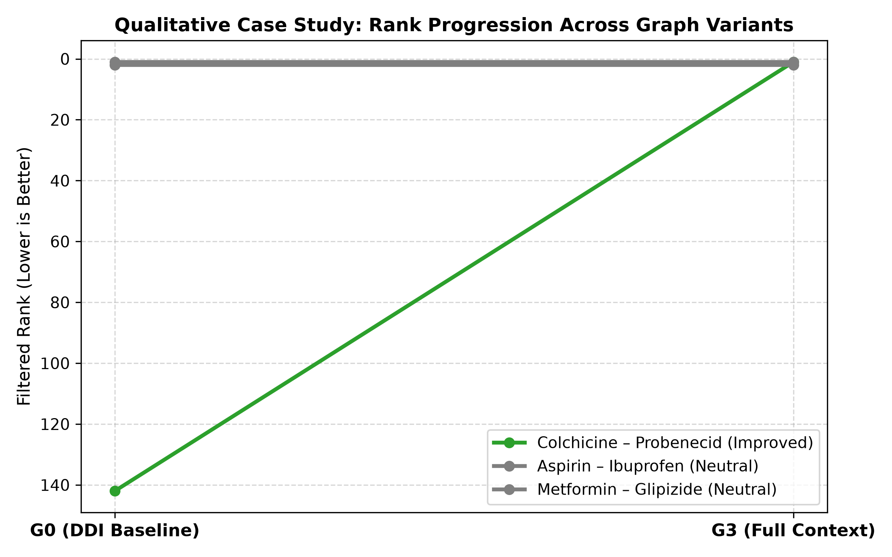

# CHEERS

### Effect of Biomedical Knowledge Graph Composition on R-GCN-Based Drug–Drug Interaction Prediction

**Team CHEERS**
**Pusan National University — Department of Computer Science**

---

## 1. Project Background

### 1.1. Domestic and International Market Status and Problems

Drug–Drug Interaction (DDI) is an important problem in biomedical and clinical informatics because drugs may interact with one another through shared biological targets, enzymes, transporters, diseases, and other biomedical relationships.

Biomedical Knowledge Graphs (KGs) provide a way to represent these heterogeneous relationships as a graph. By combining multiple biomedical relation types, a knowledge graph can provide contextual information beyond direct drug–drug relationships.

However, adding more biomedical information does not necessarily guarantee better DDI prediction performance. Additional relations may provide useful context, but they may also introduce noise or unnecessary graph complexity.

CHEERS therefore focuses on the following research question:

> **How does biomedical knowledge graph composition affect R-GCN-based drug–drug link prediction?**

Rather than simply building a larger graph, CHEERS evaluates how different combinations of biomedical relations affect an R-GCN model under a controlled experimental setting.

The project uses **PrimeKG** as the main biomedical knowledge graph and focuses on its `drug_drug` relation as the target prediction task.

In the application, this target relation is displayed as **“synergistic interaction.”**

> **Scope:** CHEERS does not attempt to predict every clinically meaningful drug–drug interaction. The target relation is the `drug_drug` relation available in PrimeKG.

---

### 1.2. Necessity and Expected Effects

A major challenge in biomedical graph learning is determining which types of contextual information are actually useful for a prediction task.

Simply adding more relations can increase graph complexity, computational cost, and noise. Therefore, it is important to experimentally compare different graph compositions while keeping the prediction task and model architecture fixed.

CHEERS addresses this problem through a controlled comparison of four graph variants:

* **G0:** DDI only
* **G1:** DDI + Drug-Gene/Protein
* **G2:** DDI + Drug-Disease
* **G3:** DDI + Drug-Gene/Protein + Drug-Disease

All graph variants use the same DDI split, R-GCN architecture, decoder, training procedure, and evaluation protocol.

The expected contributions are:

1. Quantifying the effect of biomedical graph composition on DDI link prediction.
2. Identifying relation families that provide useful contextual information.
3. Providing reproducible experimental artifacts and verification results.
4. Demonstrating how research-oriented DDI prediction can be connected to a lightweight web application.
5. Separating model-generated ranking results from independently retrieved FDA/PubMed evidence.

---

# 2. Development Goals

## 2.1. Goals and Detailed Contents

The main goal of CHEERS is to investigate the effect of biomedical knowledge graph composition on **R-GCN-based drug–drug link prediction**.

### Research Question

> **How does biomedical knowledge graph composition affect R-GCN-based drug–drug link prediction?**

### Overall Research Pipeline

```text
PrimeKG
   ↓
Canonical DDI Pair Construction
   ↓
Fixed Train / Validation / Test Split
   ↓
G0 / G1 / G2 / G3 Graph Construction
   ↓
Same R-GCN Architecture
   ↓
Filtered Link Prediction
   ↓
MRR / Hits@1 / Hits@5 / Hits@10
   ↓
Graph Composition Comparison
```

### Project Evolution

The project initially considered a broader clinical inference pipeline:

```text
Symptoms
   ↓
Disease
   ↓
Treatment Drug
   ↓
Drug–Drug Interaction Warning
```

Early development considered multiple biomedical knowledge graph and embedding approaches, including:

* PrimeKG
* DrugBank
* DDInter
* TransE
* ComplEx
* RotatE
* PyKEEN
* FastAPI
* React
* Cytoscape

The research scope was subsequently narrowed to:

> **PrimeKG + R-GCN + Drug–Drug Interaction Prediction**

This narrower scope allows graph composition to be evaluated under controlled experimental conditions.

---

### PrimeKG DDI Canonicalization

PrimeKG contains directed DDI rows that represent the same undirected drug pair in both directions.

The canonicalization process produced:

| Item                    |     Count |
| ----------------------- | --------: |
| Directed DDI rows       | 2,672,628 |
| Unique undirected pairs | 1,336,314 |
| Reverse duplicates      | 1,336,314 |
| Self-loops              |         0 |

The final experiment uses canonical unique DDI pairs.

---

### Fixed DDI Split

The same DDI split is used for every graph variant.

| Split      |         Pairs |
| ---------- | ------------: |
| Train      |     1,069,080 |
| Validation |       133,620 |
| Test       |       133,614 |
| **Total**  | **1,336,314** |

The split is:

* fixed across G0–G3
* free of train/validation/test overlap
* symmetric-duplicate removed
* transductive

Validation and test DDI edges are excluded from the message-passing adjacency to prevent target-edge leakage.

---

### Graph Composition

The experiment compares four graph variants.

| Variant | Composition                            | Directed Edges | Active Relations |
| ------- | -------------------------------------- | -------------: | ---------------: |
| **G0**  | DDI only                               |      2,138,160 |                1 |
| **G1**  | DDI + Drug-Gene/Protein                |      2,189,466 |                9 |
| **G2**  | DDI + Drug-Disease                     |      2,223,422 |                7 |
| **G3**  | DDI + Drug-Gene/Protein + Drug-Disease |      2,274,728 |               15 |

Additional relation counts:

**G1 Drug-Gene/Protein forward relations**

| Relation    |      Edges |
| ----------- | ---------: |
| Target      |     16,380 |
| Enzyme      |      5,317 |
| Transporter |      3,092 |
| Carrier     |        864 |
| **Total**   | **25,653** |

**G2 Drug-Disease forward relations**

| Relation         |      Edges |
| ---------------- | ---------: |
| Indication       |      9,388 |
| Contraindication |     30,675 |
| Off-label use    |      2,568 |
| **Total**        | **42,631** |

**G3 additional support edges**

> **68,284 forward support edges**

---

### Global Relation Mapping

| ID | Relation             |
| -: | -------------------- |
|  0 | drug_drug            |
|  1 | target               |
|  2 | rev_target           |
|  3 | enzyme               |
|  4 | rev_enzyme           |
|  5 | transporter          |
|  6 | rev_transporter      |
|  7 | carrier              |
|  8 | rev_carrier          |
|  9 | indication           |
| 10 | rev_indication       |
| 11 | contraindication     |
| 12 | rev_contraindication |
| 13 | off-label use        |
| 14 | rev_off-label use    |

---

### Graph Nodes

The final graph contains:

* **13,094 shared graph nodes**
* **4,278 candidate drug nodes**
* **15 relation types**
* **4,278 × 4,278 known-positive mask**
* **2,672,628 symmetric known-positive entries**

---

### R-GCN Model

The final model uses a two-layer Relational Graph Convolutional Network.

| Configuration            | Value                            |
| ------------------------ | -------------------------------- |
| GNN                      | 2-layer RGCNConv                 |
| Embedding dimension      | 128                              |
| Hidden dimension         | 128                              |
| Dropout                  | 0.2                              |
| Learning rate            | 0.001                            |
| Weight decay             | 1e-5                             |
| Maximum epochs           | 500                              |
| Early stopping patience  | 10                               |
| Positive samples / epoch | 100,000                          |
| Negative sampling ratio  | 1:1                              |
| Parameters               | 2,200,704                        |
| Decoder                  | Symmetric DistMult-style decoder |

---

### Negative Sampling

Negative samples are randomly sampled from **unobserved drug pairs**.

Therefore:

> An unobserved pair is not treated as a confirmed negative interaction.

The sampled negatives represent candidate unknown pairs rather than clinically verified non-interactions.

---

### Training and Model Selection

All graph variants use the same:

* fixed DDI split
* R-GCN architecture
* optimization configuration
* training protocol
* evaluation procedure

Validation BCE is used for checkpoint selection.

The test set is not used for model selection.

The final G3 seed-44 checkpoint is:

```text
checkpoints/rgcn_multiseed/G3_seed44_best.pt
```

The best epoch for G3 seed-44 was **499**.

---

### Filtered Ranking Evaluation

The test set contains:

* 133,614 held-out DDI pairs
* 2 directions per pair
* 267,228 ranking queries
* 4,278 candidate drugs per query

The evaluation metrics are:

* Mean Reciprocal Rank (MRR)
* Hits@1
* Hits@5
* Hits@10

Known positive DDI pairs are filtered from the candidate ranking set.

---

## 2.2. Differentiation from Existing Services

CHEERS differs from conventional drug interaction lookup services in several aspects.

### 1. Controlled knowledge graph composition experiment

Rather than only retrieving known DDI information, CHEERS investigates how different biomedical graph compositions affect an R-GCN model.

### 2. Same model and evaluation conditions

The G0–G3 comparison keeps the following fixed:

* DDI split
* R-GCN architecture
* decoder
* training procedure
* filtered ranking protocol

Therefore, graph composition is the primary experimental variable.

### 3. Relation-level ablation

The project also examines individual relation families through A1–A7 ablation experiments.

### 4. Research-oriented prediction interface

The web application allows users to explore model-generated rankings while clearly distinguishing those rankings from external biomedical evidence.

### 5. Lightweight inference

The final demonstration can run using NumPy-based inference without requiring a GPU or the original PyTorch/PyG training environment.

---

## 2.3. Social Value and Sustainability Plan

CHEERS is designed as a **research and educational demonstration**, rather than a clinical decision-support system.

The project aims to contribute to:

* reproducible biomedical AI research
* transparent knowledge graph experimentation
* educational use of graph-based biomedical prediction
* responsible presentation of AI-generated biomedical information
* separation of model predictions and external medical evidence

The system does not provide:

* prescribing recommendations
* medication discontinuation recommendations
* dosage recommendations
* definitive safe/dangerous judgments
* clinical risk assessments

Clinical interpretation requires qualified medical professionals and appropriate external evidence.

---

# 3. System Design

## 3.1. System Architecture

### Overall Research Architecture

```text
                         ┌─────────────────────┐
                         │       PrimeKG       │
                         └──────────┬──────────┘
                                    │
                                    ▼
                       ┌─────────────────────────┐
                       │ Canonical DDI Processing│
                       └────────────┬────────────┘
                                    │
              ┌─────────────────────┼─────────────────────┐
              │                     │                     │
              ▼                     ▼                     ▼
           ┌──────┐              ┌──────┐              ┌──────┐
           │  G0  │              │  G1  │              │  G2  │
           │ DDI  │              │ DDI  │              │ DDI  │
           │ only │              │ +GP  │              │ +DD  │
           └───┬──┘              └───┬──┘              └───┬──┘
               │                     │                     │
               └─────────────────────┼─────────────────────┘
                                     │
                                     ▼
                               ┌───────────┐
                               │    G3     │
                               │ DDI + GP  │
                               │    + DD   │
                               └─────┬─────┘
                                     │
                                     ▼
                              ┌─────────────┐
                              │    R-GCN    │
                              │ 2 Layers    │
                              └──────┬──────┘
                                     │
                                     ▼
                            ┌──────────────────┐
                            │ Link Prediction  │
                            └────────┬─────────┘
                                     │
                                     ▼
                         ┌────────────────────────┐
                         │ Filtered Ranking       │
                         │ MRR / Hits@K           │
                         └────────────────────────┘
```

### Application Architecture

```text
┌─────────────────────────────────────────────────────┐
│                    Web Frontend                     │
│              HTML / CSS / Vanilla JS                │
└───────────────────────┬─────────────────────────────┘
                        │ HTTP
                        ▼
┌─────────────────────────────────────────────────────┐
│                  FastAPI Backend                    │
├─────────────────────────────────────────────────────┤
│ Drug Search                                         │
│ DDI Prediction                                      │
│ Pair Context                                        │
│ Experiment Information                              │
│ Verification Information                            │
│ FDA / PubMed Evidence Retrieval                     │
└───────────────┬──────────────────┬──────────────────┘
                │                  │
                ▼                  ▼
       ┌────────────────┐   ┌──────────────────┐
       │ NumPy Runtime  │   │ External Sources │
       │ Final G3 Model │   │ openFDA / PubMed │
       └────────────────┘   └──────────────────┘
```

---

## 3.2. Technologies Used

### Machine Learning

* Python
* PyTorch
* PyTorch Geometric
* R-GCN
* NumPy

### Backend

* FastAPI
* Python standard library
* NumPy

### Frontend

* HTML
* CSS
* Vanilla JavaScript

### External Data / Evidence

* PrimeKG
* openFDA
* PubMed

### Development Environment

The original training environment was:

```text
Environment: /workspace/primekg_ddi_rgcn
Conda environment: primekg-rgcn

Python: 3.10.20
PyTorch: 2.2.1+cu121
PyTorch Geometric: 2.5.3
NumPy: 1.26.4
GPU: 4 × RTX 2080 Ti
```

The final physical training run used an isolated GPU.

---

# 4. Development Results

## 4.1. Overall System Flow

### Research Flow

```text
PrimeKG
   │
   ├── Drug–Drug Relations
   │
   ├── Drug–Gene/Protein Relations
   │
   └── Drug–Disease Relations
           │
           ▼
    Graph Composition
       G0 / G1 / G2 / G3
           │
           ▼
        R-GCN
           │
           ▼
    DDI Link Prediction
           │
           ▼
    Filtered Ranking
           │
           ▼
   MRR / Hits@K
```

### Application Flow

```text
User
 │
 ▼
Drug Search
 │
 ▼
Select Drug
 │
 ▼
DDI Prediction
 │
 ├───────────────┐
 ▼               ▼
Top-K Ranking   Known DDI Filtering
 │
 ▼
Pair Context
 │
 ├───────────────┐
 ▼               ▼
Graph Context   External Evidence
                │
                ├── openFDA
                └── PubMed
```

---

## 4.2. Feature Description and Main Functional Specifications

### 4.2.1. Drug Search

Users can search for drugs using:

* partial drug names
* exact drug names
* DrugBank IDs
* autocomplete suggestions

**Input**

```text
Drug name or DrugBank ID
```

**Output**

```text
Matched drug
DrugBank ID
Available prediction information
```

---

### 4.2.2. DDI Predictor

The DDI Predictor uses the final G3/seed-44 model export to rank candidate drugs.

**Input**

```text
Query drug
Top-K value
```

**Output**

```text
Candidate drug
DrugBank ID
Raw model score
Ranking
```

The raw score is a ranking value.

It is **not**:

* a probability
* calibrated confidence
* clinical risk
* interaction severity
* a safe/dangerous classification

---

### 4.2.3. Known-Positive Filtering

Known DDI pairs are filtered from candidate results.

For the final standalone inference verification:

```text
Candidate drugs: 4,278
Known positive pairs filtered: 1,488
Remaining candidates: 2,789
```

---

### 4.2.4. Graph Context Explorer

The application provides graph context associated with predicted pairs.

For example, the G3 context runtime contains:

```text
Total forward support rows: 68,284
Drug-Gene/Protein: 25,653
Drug-Disease: 42,631
```

The graph context is descriptive and should not be interpreted as a causal explanation.

---

### 4.2.5. Pair Context

For the verified example:

```text
Query drug: Colchicine
DrugBank ID: DB01394

Candidate drug: Probenecid
DrugBank ID: DB01032
```

The G3 context runtime reports:

```text
Colchicine support entities: 39
Probenecid support entities: 69
Shared entities: 33
Shared gene/protein entities: 3
Shared disease entities: 30
```

Shared gene/protein examples include:

```text
ALB
CYP2C8
CYP3A4
```

These relationships are presented as graph context rather than causal explanations.

---

### 4.2.6. External Evidence

CHEERS separately retrieves external evidence from:

* **openFDA**
* **PubMed**

The evidence retrieval process does not use an LLM to generate medical conclusions.

For selected drug pairs, the system retrieves explicit cross-drug mentions from relevant FDA label sections and searches PubMed using both drug names.

API endpoint:

```text
/api/evidence/pair?drug_a_id=DB01394&drug_b_id=DB01032
```

---

### 4.2.7. Experiment Information

The web application provides information about:

* G0–G3 graph composition
* model configuration
* evaluation methodology
* verification results
* research limitations

---

### 4.2.8. API Endpoints

| Endpoint             | Description              |
| -------------------- | ------------------------ |
| `/`                  | Web application          |
| `/api`               | API information          |
| `/api/health`        | Health check             |
| `/api/model`         | Model information        |
| `/api/experiment`    | Experiment information   |
| `/api/verification`  | Verification information |
| `/api/drugs/search`  | Drug search              |
| `/api/predict`       | DDI prediction           |
| `/api/context/pair`  | Pair graph context       |
| `/api/evidence/pair` | FDA/PubMed evidence      |
| `/docs`              | FastAPI documentation    |

---

### 4.2.9. Final Verification Results

The final project includes several verification procedures.

#### 1. Target-edge leakage check

```text
Validation target-edge leakage: 0
Test target-edge leakage: 0
```

#### 2. Test ranking verification

A 1,000-pair test subset was evaluated in both directions:

```text
Queries: 2,000

MRR:     0.502226
Hits@1:  0.4525
Hits@5:  0.5465
Hits@10: 0.5870

Median rank: 2
```

#### 3. Positive vs. unobserved-pair sanity check

```text
Positive mean score:       161.370407
Positive median score:       6.497307

Unobserved mean score:      -2.773926
Unobserved median score:    -1.558111

Pairwise win rate:           97.54%
ROC-AUC:                     0.9737
```

These values are a sanity check against unobserved pairs and should not be interpreted as clinical performance.

#### 4. Metadata resolution

All:

```text
13,094 graph nodes
4,278 candidate drugs
```

resolve to available metadata.

#### 5. Checkpoint reproducibility

The G3 seed-44 checkpoint reproduces:

```text
MRR:     0.540359
Hits@1:  0.490656
Hits@5:  0.588273
Hits@10: 0.626229
```

#### 6. Graph edge-count verification

The final graph variants match the expected edge counts described in the experiment configuration.

#### 7. Standalone inference verification

Verified query:

```text
Colchicine
DrugBank ID: DB01394
```

Final G3/seed-44 lightweight inference produced the following Top-10 ranking after filtering known-positive pairs:

| Rank | Drug                             | DrugBank ID |   Score |
| ---: | -------------------------------- | ----------- | ------: |
|    1 | Probenecid                       | DB01032     | 40.8524 |
|    2 | Hydrocortisone                   | DB00741     |  7.9139 |
|    3 | Ondansetron                      | DB00904     |  5.7451 |
|    4 | Sulfinpyrazone                   | DB01138     |  5.6925 |
|    5 | Melengestrol acetate             | DB14659     |  5.5811 |
|    6 | Prednisone acetate               | DB14646     |  5.2154 |
|    7 | Coumarin                         | DB04665     |  5.1917 |
|    8 | Dicoumarol                       | DB00266     |  5.1416 |
|    9 | Methylprednisolone hemisuccinate | DB14644     |  5.0514 |
|   10 | Oxycodone                        | DB00497     |  4.9924 |

---

### Relation Ablation Analysis

The project also evaluates individual relation families through A1–A7 experiments.

| Experiment | Relation         |                 MRR |     Δ MRR | Positive Seeds |
| ---------- | ---------------- | ------------------: | --------: | -------------: |
| Baseline   | G0               | 0.529118 ± 0.008136 |         — |              — |
| A1         | Target           | 0.535154 ± 0.009967 | +0.006036 |            2/3 |
| A2         | Enzyme           | 0.527979 ± 0.002269 | −0.001138 |            1/3 |
| A3         | Transporter      | 0.532645 ± 0.010348 | +0.003528 |            3/3 |
| A4         | Carrier          | 0.535263 ± 0.005680 | +0.006145 |            3/3 |
| A5         | Indication       | 0.535659 ± 0.008666 | +0.006542 |            2/3 |
| A6         | Contraindication | 0.525807 ± 0.003087 | −0.003311 |            1/3 |
| A7         | Off-label use    | 0.510576 ± 0.038774 | −0.018541 |            1/3 |

### Relation Ablation Figure



The relation ablation results indicate that the contribution of biomedical relation families is not uniform. Some relation families improve the measured ranking performance in this experiment, while others do not.

These results should be interpreted as associations observed in this experimental setting rather than causal effects.

---

### Case Study Visualization



The corresponding data are available in:

```text
case_study_ranks.csv
```

---

## 4.3. Directory Structure

```text
CHEERS/
├── api/
├── checkpoints/
├── data/
├── docs/
├── figures/
├── final_release/
├── frontend/
├── notebooks/
├── results/
├── scripts/
├── src/
├── web/
├── .github/
├── .gitignore
├── PORTABLE_APP_MANIFEST.json
├── README.md
└── THIRD_PARTY_NOTICES.md
```

### Important directories

```text
checkpoints/
```

Contains trained model checkpoints.

```text
data/
```

Contains processed graph and model-related data.

```text
figures/
```

Contains research visualization files.

```text
final_release/
```

Contains lightweight runtime artifacts, context runtime files, verification materials, and release manifests.

```text
results/
```

Contains experiment results, including the current five-seed graph-composition summary.

```text
scripts/
```

Contains utility and verification scripts.

```text
src/
```

Contains research/model source code.

```text
web/
```

Contains web application-related components.

---

## 4.4. Industry Mentoring Feedback and Reflected Changes

### Mentoring Feedback

> **[To be added]**

### Reflected Changes

> **[To be added]**

Recommended contents:

* Mentor feedback
* Problems identified during mentoring
* Changes made to the research design
* Changes made to the application
* Changes made to the documentation
* Additional verification or testing performed after mentoring

---

# 5. Installation and Execution

## 5.1. Installation and Execution Procedure

CHEERS provides two different execution environments.

### A. Full Research / Training Environment

The original training environment used:

```text
Python 3.10.20
PyTorch 2.2.1+cu121
PyTorch Geometric 2.5.3
NumPy 1.26.4
```

The original environment was configured as:

```text
/workspace/primekg_ddi_rgcn
```

with the Conda environment:

```text
primekg-rgcn
```

The original training environment used NVIDIA GPUs.

The full preprocessing and retraining pipeline is **not completely self-contained in the portable repository**.

The original research notebooks included:

```text
00_environment_check
01_inspect_primekg
02_build_graph_variants
03_prepare_rgcn_data
04_train_rgcn
05_repeat_seeds
06_finalize_project
```

---

### B. Lightweight Web Application

The final application uses:

```text
FastAPI
NumPy
Python standard library
HTML
CSS
Vanilla JavaScript
```

The lightweight runtime does not require:

* PyTorch
* PyTorch Geometric
* CUDA
* GPU
* React
* Node.js
* npm
* external CDN

### Lightweight Runtime Files

```text
final_release/lightweight_runtime/
├── ddi_runtime_embeddings.npz
├── drug_metadata.csv
├── known_positive_mask_packed.npz
└── manifest
```

The main scoring operation is based on:

```text
query_embedding @ (candidate_embeddings * ddi_relation).T
```

The runtime was verified against the final G3/seed-44 inference output.

---

### G3 Context Runtime

```text
final_release/g3_context_runtime/
```

contains relation-preserving graph context information used by the application.

The runtime contains:

```text
68,284 total forward support rows
25,653 Drug-Gene/Protein rows
42,631 Drug-Disease rows
```

---

### Running the Application

From the project root:

```bash
cd CHEERS
```

Then start the FastAPI application according to the provided application entry point.

The application provides:

```text
/
 /api
 /api/health
 /api/model
 /api/experiment
 /api/verification
 /api/drugs/search
 /api/predict
 /api/context/pair
 /api/evidence/pair
 /docs
```

The exact host/port configuration should follow the current project configuration files.

---

## 5.2. Troubleshooting

### Problem 1. Missing Python dependencies

If running the full research environment, verify:

```bash
python --version
```

Expected:

```text
Python 3.10.20
```

For the full training environment, verify the installed versions of PyTorch and PyTorch Geometric.

---

### Problem 2. GPU/CUDA errors

The full training environment requires a compatible PyTorch/CUDA configuration.

The lightweight runtime does **not** require CUDA or a GPU.

For demonstration purposes, use the lightweight runtime when possible.

---

### Problem 3. Missing model artifacts

Check:

```text
final_release/lightweight_runtime/
```

and:

```text
checkpoints/
```

The portable inference application is based on exported runtime artifacts rather than requiring the original training checkpoint for every request.

---

### Problem 4. Port already in use

If the configured port is already occupied, stop the existing process or change the application port according to the current FastAPI launch configuration.

---

### Problem 5. External evidence unavailable

The FDA/PubMed evidence feature requires network access to the external services.

If external retrieval fails, the model prediction and graph context components remain conceptually separate from the external evidence layer.

---

# 6. Introduction Materials and Demonstration Video

## 6.1. Project Introduction Materials

### Project Presentation

> **[PPT / Presentation Link — To be added]**

### Project Documentation

The repository contains the research materials, experiment artifacts, verification results, and application resources required to understand the project.

Important release documents include:

```text
README.md
PORTABLE_APP_MANIFEST.json
THIRD_PARTY_NOTICES.md
final_release/PORTABLE_APP_MANIFEST_V2.json
final_release/PORTABLE_APP_MANIFEST_V3.json
```

---

## 6.2. Demonstration Video

> **[Demo Video Link — To be added]**

The demonstration video is planned to show:

1. Drug search
2. DDI prediction
3. Top-K ranking
4. Known-positive filtering
5. Graph context exploration
6. Pair context
7. FDA/PubMed evidence retrieval
8. Experiment and verification information

---

# 7. Team

## 7.1. Team Members and Roles

### Team CHEERS

| Member         | Student ID | Major / Grade   | Role   | Main Responsibilities |
| -------------- | ---------- | --------------- | ------ | --------------------- |
| **[Member 1]** | [ID]       | [Major / Grade] | [Role] | [Responsibilities]    |
| **[Member 2]** | [ID]       | [Major / Grade] | [Role] | [Responsibilities]    |
| **[Member 3]** | [ID]       | [Major / Grade] | [Role] | [Responsibilities]    |

### Recommended information for each member

Each member's profile should include:

* Name
* Student ID, if required
* Major / grade, if required
* Main role
* Specific responsibilities
* Main contribution to the project

---

## 7.2. Team Member Reflections

### [Member 1]

> **[To be added]**

The reflection may include:

* What I contributed to CHEERS
* What I learned
* Technical difficulties I encountered
* How I overcame those difficulties
* What I learned from team collaboration
* What I would improve in future projects

### [Member 2]

> **[To be added]**

### [Member 3]

> **[To be added]**

---

# 8. References and Sources

## Biomedical Knowledge Graph

* PrimeKG

## Drug–Drug Interaction Data

* PrimeKG `drug_drug` relation

## External Evidence

* U.S. Food and Drug Administration openFDA
* PubMed / National Library of Medicine

## Graph Neural Network

* Relational Graph Convolutional Network (R-GCN)

## Software and Frameworks

* PyTorch
* PyTorch Geometric
* NumPy
* FastAPI

## Project Resources

The repository also includes:

```text
THIRD_PARTY_NOTICES.md
```

for third-party software and resource notices.

---

# Research Results and Interpretation

## Graph Composition Experiment

The final graph-composition experiment uses the current **five-seed** result summary stored at:

```text
results/live_5seed/final_experiment_summary.json
```

This five-seed analysis is the authoritative result for the final G0–G3 graph-composition experiment.

The older three-seed graph-composition values that appeared in earlier project documentation are retained only as historical project-stage results and should not be treated as the final graph-composition result.

---

## Relation Ablation Experiment

The A1–A7 relation-family ablation remains a three-seed analysis.

The experiment investigates whether individual biomedical relation families provide useful contextual information for the DDI prediction task.

The results demonstrate that the contribution of relation families varies across the experimental conditions.

---

# Lightweight Inference

The lightweight runtime uses the final verified model export.

The core scoring operation is:

```text
query_embedding @ (candidate_embeddings * ddi_relation).T
```

This allows the final model to be demonstrated without requiring the complete original training environment.

---

# Reproducibility

CHEERS provides two levels of reproducibility.

### Level 1 — Verified Lightweight Demonstration

The repository supports:

* lightweight inference
* drug search
* DDI ranking
* known-positive filtering
* graph context exploration
* external evidence retrieval
* verification information

### Level 2 — Full Research Retraining

Full preprocessing and retraining require the original research environment and source-data preparation.

The complete original training pipeline is therefore not represented as a single self-contained one-command reproduction environment.

---

# Limitations

The following limitations should be considered when interpreting the results.

1. The experiment is based on PrimeKG.
2. The target relation is PrimeKG's `drug_drug` relation.
3. The target relation is displayed as “synergistic interaction” in the application.
4. The study evaluates one principal GNN architecture, R-GCN.
5. Current graph-composition robustness is based on five random seeds.
6. Relation-family ablation results are based on three seeds.
7. No statistical significance testing is included.
8. The experiment is transductive.
9. Unobserved pairs used for negative sampling are not confirmed negative interactions.
10. Biomedical knowledge graphs may contain missing or biased information.
11. Raw model scores are not calibrated probabilities.
12. Graph context does not establish causality.
13. A predicted link does not confirm a clinical drug interaction.
14. Full preprocessing and retraining are not completely contained in the portable application.
15. The application is intended for research and educational use only.

---

# Future Work

Possible future improvements include:

* More random seeds and bootstrap analysis
* Statistical significance testing
* Per-relation ablation with larger repetitions
* Comparison with additional GNN/KG baselines
* Inductive and cold-start evaluation
* External DDI validation
* Calibrated DDI classification
* Integration of additional biomedical data sources
* Broader DailyMed/openFDA evidence retrieval
* Improved synonym-aware drug matching
* Systematic literature review
* Pair-level explanatory paths
* More detailed relation semantics in the user interface

---

# Safety and Responsible Use

CHEERS is a **research and educational demonstration**.

The model output represents a learned ranking from a biomedical knowledge graph and should not be interpreted as a clinical recommendation.

The system must not be used as a basis for:

* prescribing medication
* stopping medication
* changing medication dosage
* determining whether a drug combination is safe or dangerous
* making clinical treatment decisions

For clinical decisions, users should consult qualified healthcare professionals and appropriate authoritative medical resources.

---

# Project Status

**Research:** Completed
**Graph Composition Experiment:** Completed
**Relation Ablation:** Completed
**Final Verification:** Completed
**Lightweight Runtime:** Completed
**Web Application:** Completed
**Documentation:** In progress
**Presentation / Demo Materials:** To be added

---

# Team CHEERS

**Pusan National University — Department of Computer Science**

> **Effect of Biomedical Knowledge Graph Composition on R-GCN-Based Drug–Drug Interaction Prediction**
